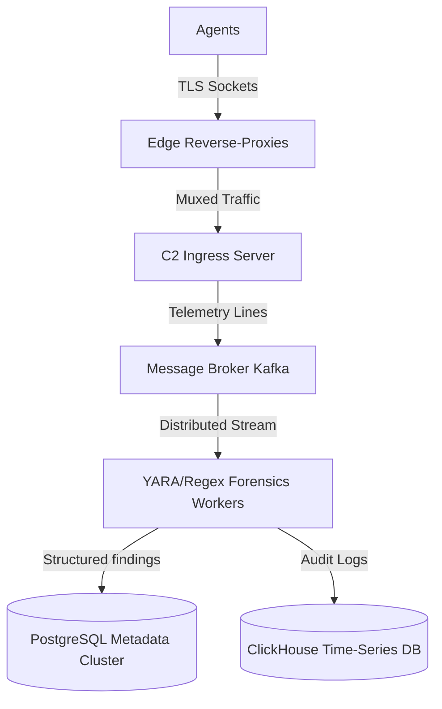

# Inferno SaaS — Long-Term Enterprise Evolution Roadmap

This document outlines the architectural and capability enhancements to transition Inferno from a functional proof-of-concept C2 framework into a high-performance, resilient, and AI-enhanced enterprise-scale system. These objectives are scheduled to commence immediately following the completion of the 9 base circles.

---

## Phase I: Forensic Extraction & Deduplication Hardening

### 1. Robust Keystroke Reconstruction
*   **Arrow & Mouse Tracking**: Expand the client's keystroke event logging to capture cursor movements (`[LEFT]`, `[RIGHT]`, `[UP]`, `[DOWN]`) and text-selection modifications, allowing the server to reconstruct cursor-jumps and text replacements rather than assuming simple linear deletions.
*   **Boundary Split Detection**: Implement a double-buffer overlap scan at the boundaries of the sliding window to ensure patterns (e.g. credit card sequences) cut in half across sliding windows are reconstructed and analyzed correctly.

### 2. Context-Aware Deduplication & Merging
*   **Session-Bounded Substrings**: Limit substring deduplication rules to active credential login flows.
*   **Context Collision Resolution**: Prevent merging of identical substrings captured from different services/applications by matching the active process context (e.g. Chrome vs. Slack) before performing database merges.

---

## Phase II: High-Performance Decoupled Architecture

### 1. Ingress & Message Broker Decoupling
*   **Kafka/RabbitMQ Ingestion**: Decouple connection management from analysis by having the C2 server immediately publish raw incoming telemetry streams to an Apache Kafka or RabbitMQ broker.
*   **Worker Pool Isolation**: Spin up dedicated analysis worker microservices that subscribe to the broker and perform regex/extraction CPU loops asynchronously, removing CPU-intensive operations entirely from the core network server.

### 2. Compiled Signature Matching (YARA Rules)
*   **Dynamic Rule Engine**: Replace static C++ regex patterns with compiled **YARA rules**. This enables operators to dynamically load and deploy signature rules for identifying credit cards, cryptographic keys, or proprietary data on the fly without recompiling the server.

### 3. ClickHouse / Elasticsearch Time-Series Storage
*   Migrate audit logging and raw telemetry storage away from PostgreSQL to ClickHouse or Elasticsearch to support sub-second querying across millions of historical log rows. PostgreSQL will remain strictly reserved for metadata, system configuration, and finalized intelligence findings.

---

## Phase III: Cognitive AI Telemetry Analysis

### 1. Local Quantized NLP Extraction
*   Integrate a lightweight, local, quantized LLM (e.g. local LLaMA or BERT model running on CPU/GPU) to analyze the semantic intent of keylogs and telemetries. This bypasses static regex limits, catching credentials regardless of formatting or typing obfuscation.

### 2. Behavioral Anomaly Profiling
*   Construct machine-learning anomaly detection profiles on agent machines to establish baseline behavior (operating hours, standard process trees, expected commands). Any deviation (such as attempts to download compilers, configure remote ports, or execute privilege escalation scripts) immediately elevates the agent’s warning index on the operator GUI.

---

## Phase IV: Strict Interface Segregation & Dependency Inversion

### 1. Dependency Injection Framework
*   Refactor the codebase to strictly adhere to the Dependency Inversion Principle (DIP). Inject abstract interfaces (`IServer`, `IDatabase`, `IExtractor`) into the GUI components and service singletons.

### 2. Isolated Mocking & Testing
*   Replace standard database and socket integrations in tests with mocks, allowing full logic verification without needing a real PostgreSQL engine or network sockets.

---

## Phase V: Encrypted Transport & Covert Ingress (Circle 1 Overhaul)

### 1. Transport Encryption via mTLS 1.3
*   **The Problem**: Raw TCP traffic is trivial to inspect, dissect, and block. Intrusive Network Security Monitoring (NSM) sensors will immediately flag unencrypted C2 binary payloads.
*   **The Architecture**: Implement **Mutual TLS (mTLS 1.3)** utilizing strong elliptic curves (e.g. `X25519`) and pinned client/server certificates. 
*   **Implementation Strategy**: Integrate a secure TLS library (like `mbedtls` or `OpenSSL`) directly inside the `Socket` implementation. The server rejects any handshake lacking a cryptographically valid client certificate, preventing active probing or C2 scanning by defensive teams.

### 2. Pluggable Covert Transports
*   **The Problem**: Raw TCP connections to arbitrary ports (e.g., `4242`) are blocked by standard corporate firewalls.
*   **The Architecture**: Encapsulate the socket stream into covert ingress paths.
*   **Implementation Strategy**: Add transport adapters to compile-time options:
    *   **HTTP/2 / HTTPS Beaconing**: Implant sends periodic POST requests mimicking normal JSON/API traffic.
    *   **WebSocket Tunneling**: Establishes a persistent, bidirectional WebSocket connection disguised as normal web-socket updates (e.g., chat, stock tick feeds).
    *   **DNS Tunneling (Fallback)**: Encodes commands inside DNS subdomains (e.g. `[encoded_payload].domain.com`) to query a controlled name server, bypassing strict air-gapped network restrictions.

### 3. Epoll & Kqueue Asynchronous Socket Engine
*   **The Problem**: Standard `select()` scales quadratically $O(N^2)$ due to array scans and is limited to 1024 concurrent descriptors by `FD_SETSIZE`.
*   **The Architecture**: Re-engineer the networking core using native operating system event multiplexers: `epoll` for Linux and `kqueue` for macOS/BSD.
*   **Implementation Strategy**: Implement an event-driven networking reactor (e.g., utilizing `boost::asio` or native wrappers) capable of managing over 10,000 active agent beacons asynchronously on a single CPU core.

---

## Phase VI: Cryptographic AEAD Protocol & Signature Evasion (Circle 2 Overhaul)

### 1. Authenticated Payload Encryption (AEAD)
*   **The Problem**: Our current serialization is in cleartext, permitting middlebox rewriting, interception, and replay attacks.
*   **The Architecture**: Secure each serialized packet using Authenticated Encryption with Associated Data (AEAD).
*   **Implementation Strategy**: Adopt **AES-256-GCM** or **ChaCha20-Poly1305**. Packet headers will contain a random initialization vector (IV) and a message authentication tag (MAC) generated per-packet. The server verifies payload integrity before passing it to the deserializer, rendering tampering or spoofing mathematically impossible.

### 2. Standardized Binary Serialization
*   **The Problem**: Hand-rolled binary parsers are prone to pointer manipulation bugs and buffer overflows when deserializing untrusted, malformed network packets.
*   **The Architecture**: Use a memory-safe, fuzzed binary serialization standard.
*   **Implementation Strategy**: Replace standard byte casting with **Google Protocol Buffers (Protobuf)** or **MessagePack**. These libraries enforce strict bounds checking, versioning compatibility, and memory safety during parsing.

### 3. Malleable C2 Protocol Engine
*   **The Problem**: Static bytes (like opcodes and magic headers) create unique structural patterns easily cataloged by EDR/NDR signature engines.
*   **The Architecture**: Implement a dynamic framing engine that hides structural patterns.
*   **Implementation Strategy**: Allow the operator to define header masks, byte order randomization, and padding schemes dynamically at boot time. The server and agent adjust serialization dynamically to mimic innocuous third-party payloads (e.g. looking like standard base64 XML, JSON, or PNG image chunks).

---

## Phase VII: System Call Hook Evasion & In-Memory Execution (Circle 3 Overhaul)

### 1. User-Mode Hook Evasion (Direct & Indirect Syscalls)
*   **The Problem**: Endpoint Detection and Response (EDR) agents inject DLLs/libraries into running processes to hook standard system APIs (like `VirtualAlloc` or `NtCreateThread`).
*   **The Architecture**: Execute core actions through direct or indirect syscalls, bypassing hooked DLLs.
*   **Implementation Strategy**: Resolve system call numbers dynamically at runtime from disk files, and execute assembly instructions directly or jump to clean syscall instructions inside EDR-registered binaries, masking the origin of the execution call stack.

### 2. Beacon Object Files (BOFs) for In-Memory Execution
*   **The Problem**: Spawning shells (`popen`/`fork`) is immediately flagged by process monitors.
*   **The Architecture**: Execute all administrative tasks natively inside the agent's memory space.
*   **Implementation Strategy**: Design an internal COFF/ELF loader within the agent. Operators can compile tasks as static object files (BOFs) in C/C++ and stream them over the network. The agent links them dynamically in memory, executes them in-process, retrieves their output, and deletes them, leaving zero disk footprint and spawning no new processes.

### 3. Polymorphic Memory Encryption (Sleep/Wake Cycles)
*   **The Problem**: Memory scanners (such as YARA or Moneta) look for suspicious unencrypted strings (e.g., C2 URLs, system commands) inside process heaps and stacks.
*   **The Architecture**: Keep memory encrypted while the agent is sleeping.
*   **Implementation Strategy**: Implement a polymorphic loop where the agent encrypts its own heap, stacks, and executable code segments using a random key prior to entering its sleeping state. Upon waking up via an asynchronous timer, it decrypts itself, performs operational loops, and re-encrypts.

---

## Phase VIII: Remote Collaborative Teamserver (Circle 4 Overhaul)

### 1. Decoupled Teamserver Architecture
*   **The Problem**: The GUI dashboard is currently coupled to the local server process, prohibiting remote usage and multi-operator operations.
*   **The Architecture**: Decouple the GUI from the backend network server.
*   **Implementation Strategy**: Expose a secure **gRPC and WebSocket gateway** on the C2 Server (turning it into a "Teamserver"). The Qt operator GUI client connects remotely to the Teamserver over TLS, allowing operators to work from different locations.

### 2. Multi-Operator Orchestration & RBAC
*   **The Problem**: Multiple operators executing commands simultaneously can overwrite or conflict with each other's configurations.
*   **The Architecture**: Implement synchronization state and access control.
*   **Implementation Strategy**: Connect multiple clients to the same teamserver state. Enforce Role-Based Access Control (RBAC) defining permissions (e.g. "Observer" for read-only tracking, "Operator" for executing scripts, and "Administrator" for configuring sockets).

### 3. Operator Audit Logs
*   **The Problem**: Compliance and post-operation reviews require tracking exactly who ran what command on which victim.
*   **The Architecture**: Cryptographically signed audit trail database.
*   **Implementation Strategy**: Log every API command, shell execution, and file extraction with the operator's public key signature and timestamp into an immutable, append-only database table.

---

## Phase IX: Cryptographic Agent Authentication & Vault Configs (Circle 5 Overhaul)

### 1. Cryptographic Handshake Challenge
*   **The Problem**: Hardware UUID fingerprinting is static. If an analyst reverse-engineers the client binary, they can extract the UUID calculation algorithm and flood the server database with fake agent registrations.
*   **The Architecture**: Enforce cryptographic handshakes using asymmetric key pairs.
*   **Implementation Strategy**: Upon first connection, the agent generates a unique elliptic-curve key pair (e.g. `Ed25519`), storing the private key securely in the target host's TPM (Trusted Platform Module) or macOS Secure Enclave. The server registers the public key. On subsequent connections, the server sends a random challenge that the agent must sign using its private key, preventing spoofing or replay registration attacks.

### 2. Dynamic Secrets Vault Integration
*   **The Problem**: Storing database passwords and TLS private keys in local `.env` files is a single point of failure if the server host gets compromised.
*   **The Architecture**: Centrally managed secrets storage.
*   **Implementation Strategy**: Integrate with an enterprise secrets manager (like HashiCorp Vault or AWS KMS). The C2 server retrieves database tokens, session encryption keys, and SSL certificates dynamically in memory on startup, eliminating plaintext secrets on disk.

