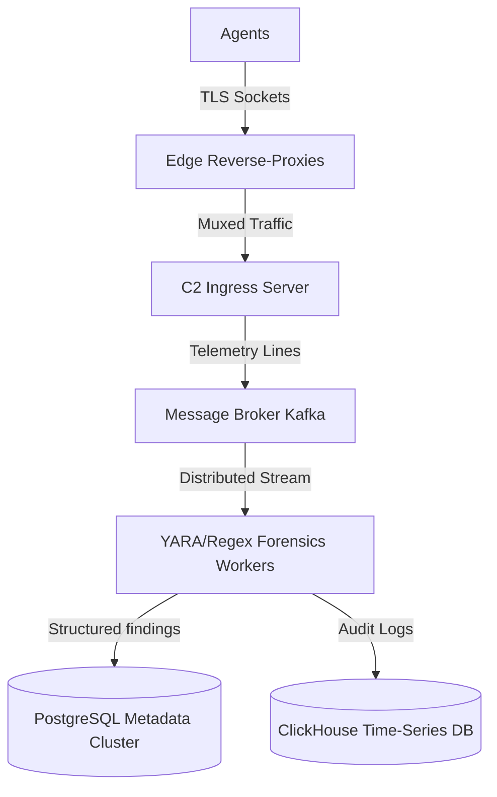

# Inferno SaaS — Long-Term Enterprise Evolution Roadmap

This document outlines the architectural and capability enhancements to transition Inferno from a functional proof-of-concept C2 framework into a high-performance, resilient, and AI-enhanced enterprise-scale system. These objectives are scheduled to commence immediately following the completion of the 9 base circles.

---

## Phase I: Forensic Extraction & Deduplication Hardening

### 1. Robust Keystroke Reconstruction
*   **Arrow & Mouse Tracking**: Expand the client's keystroke event logging to capture cursor movements (`[LEFT]`, `[RIGHT]`, `[UP]`, `[DOWN]`) and text-selection modifications, allowing the server to reconstruct cursor-jumps and text replacements rather than assuming simple linear deletions.
*   **Boundary Split Detection**: Implement a double-buffer overlap scan at the boundaries of the sliding window to ensure patterns (e.g. credit card sequences) cut in half across sliding windows are reconstructed and analyzed correctly.

### 2. Context-Aware Deduplication & Merging
*   **Session-Bounded Substrings**: Limit substring deduplication rules to active credential login flows.
*   **Context Collision Resolution**: Prevent merging of identical substrings captured from different services/applications by matching the active process context (e.g. Chrome vs. Slack) before performing database merges.

---

## Phase II: High-Performance Decoupled Architecture

### 1. Ingress & Message Broker Decoupling
*   **Kafka/RabbitMQ Ingestion**: Decouple connection management from analysis by having the C2 server immediately publish raw incoming telemetry streams to an Apache Kafka or RabbitMQ broker.
*   **Worker Pool Isolation**: Spin up dedicated analysis worker microservices that subscribe to the broker and perform regex/extraction CPU loops asynchronously, removing CPU-intensive operations entirely from the core network server.

### 2. Compiled Signature Matching (YARA Rules)
*   **Dynamic Rule Engine**: Replace static C++ regex patterns with compiled **YARA rules**. This enables operators to dynamically load and deploy signature rules for identifying credit cards, cryptographic keys, or proprietary data on the fly without recompiling the server.

### 3. ClickHouse / Elasticsearch Time-Series Storage
*   Migrate audit logging and raw telemetry storage away from PostgreSQL to ClickHouse or Elasticsearch to support sub-second querying across millions of historical log rows. PostgreSQL will remain strictly reserved for metadata, system configuration, and finalized intelligence findings.

---

## Phase III: Cognitive AI Telemetry Analysis

### 1. Local Quantized NLP Extraction
*   Integrate a lightweight, local, quantized LLM (e.g. local LLaMA or BERT model running on CPU/GPU) to analyze the semantic intent of keylogs and telemetries. This bypasses static regex limits, catching credentials regardless of formatting or typing obfuscation.

### 2. Behavioral Anomaly Profiling
*   Construct machine-learning anomaly detection profiles on agent machines to establish baseline behavior (operating hours, standard process trees, expected commands). Any deviation (such as attempts to download compilers, configure remote ports, or execute privilege escalation scripts) immediately elevates the agent’s warning index on the operator GUI.

---

## Phase IV: Strict Interface Segregation & Dependency Inversion

### 1. Dependency Injection Framework
*   Refactor the codebase to strictly adhere to the Dependency Inversion Principle (DIP). Inject abstract interfaces (`IServer`, `IDatabase`, `IExtractor`) into the GUI components and service singletons.

### 2. Isolated Mocking & Testing
*   Replace standard database and socket integrations in tests with mocks, allowing full logic verification without needing a real PostgreSQL engine or network sockets.
